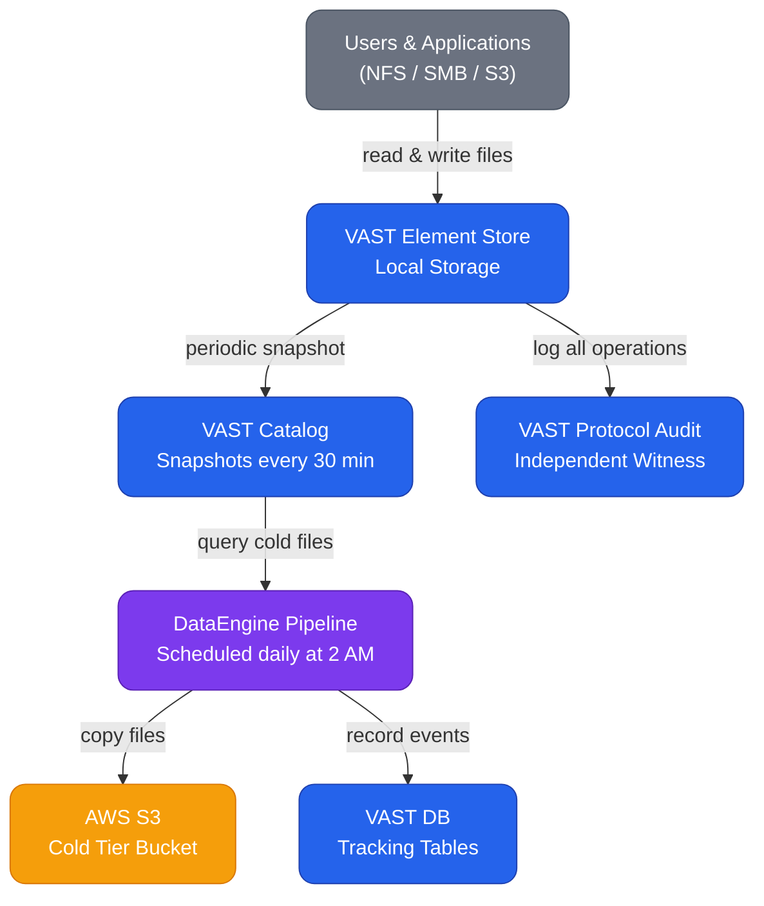
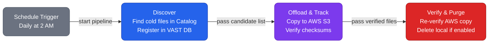
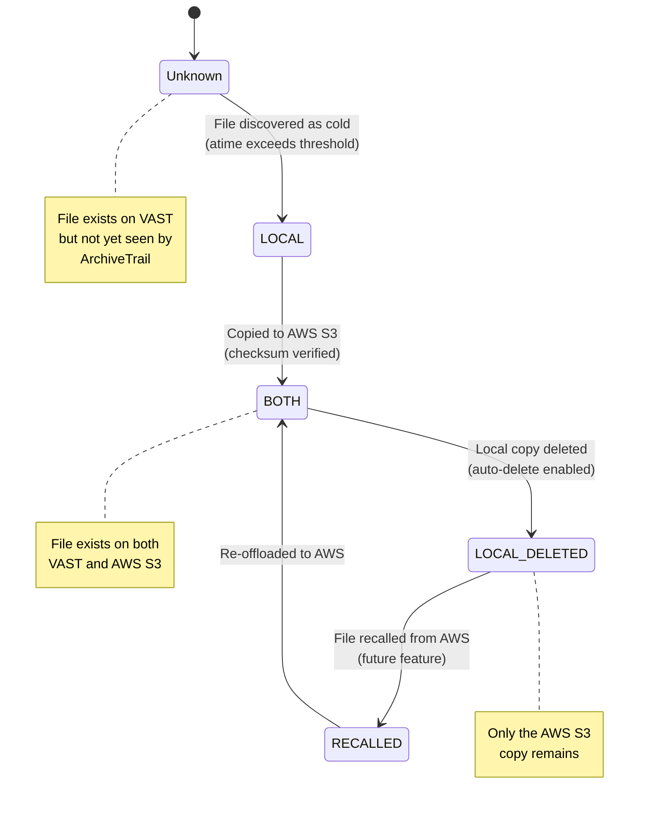
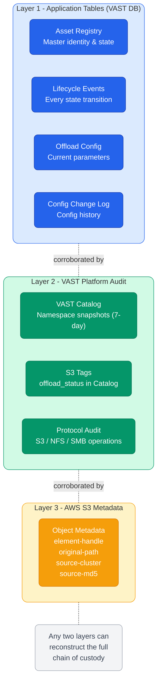
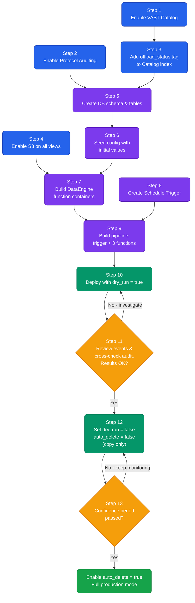
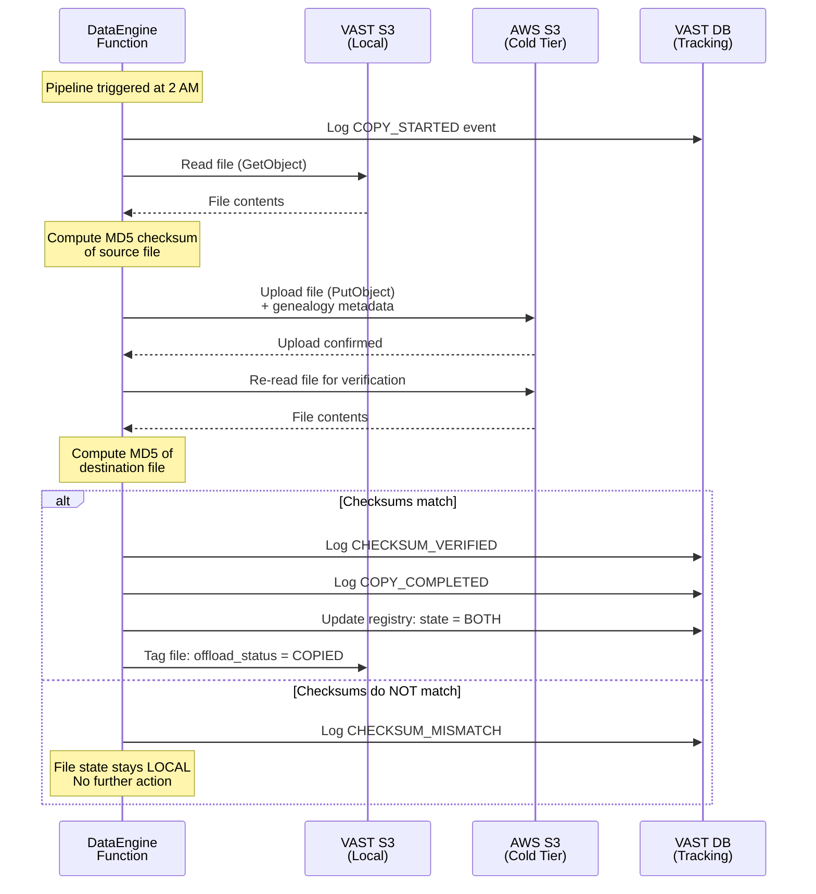
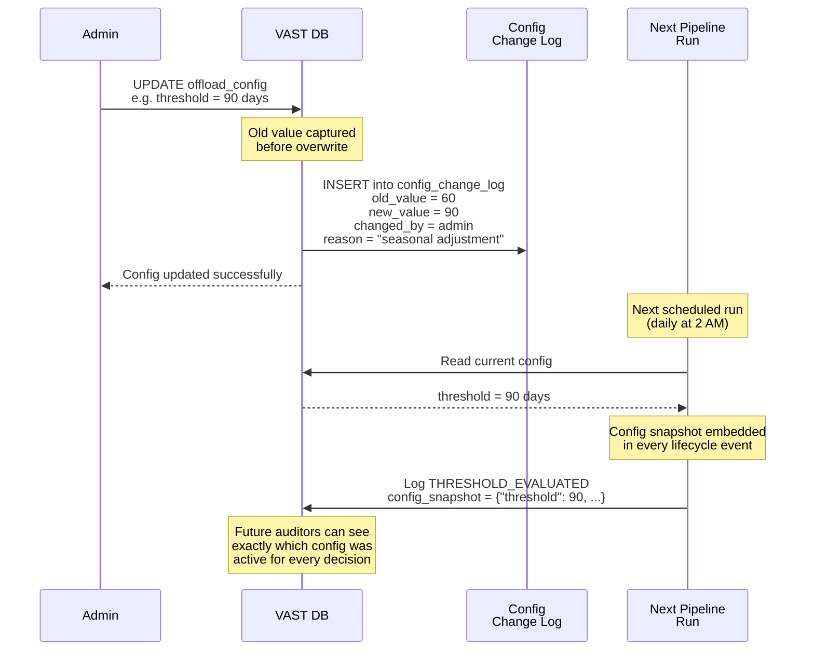

# ArchiveTrail Diagrams

Visual reference for the ArchiveTrail cold data tiering solution.

---

## 1. High-Level Architecture

---

## 2. Pipeline Flow

---

## 3. File State Machine

---

## 4. Traceability Layers

---

## 5. Deployment Steps

---

## 6. Data Flow During Offload

---

## 7. Configuration Change Flow

