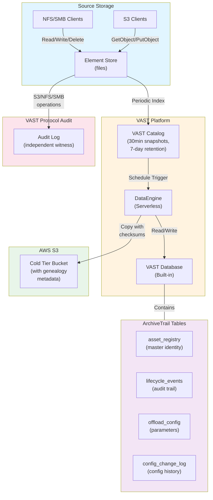
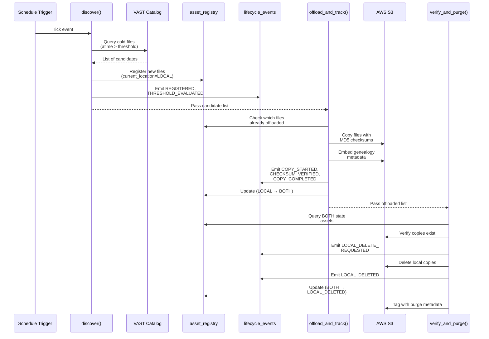
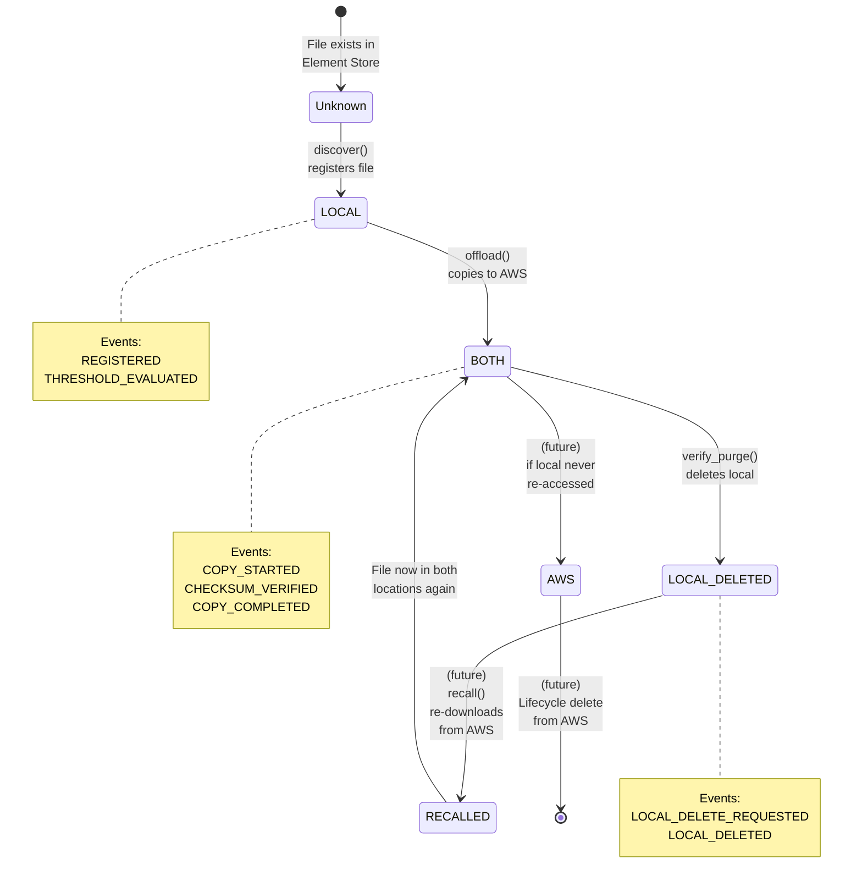
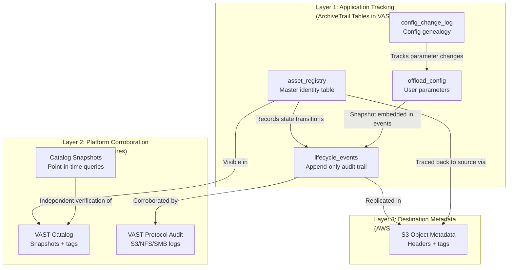

# ArchiveTrail Architecture

This document describes the detailed design of ArchiveTrail, including the system architecture, pipeline flow, state machine, and three-layer traceability model.

## System Architecture



## Pipeline Flow

The ArchiveTrail pipeline runs on a configurable schedule (e.g., daily at 2 AM) and consists of three sequential stages, each implemented as a VAST DataEngine function.



### Stage 1: Discover

**Function:** `archive-trail-discover`

**Purpose:** Query VAST Catalog for files whose last access time exceeds the configured threshold, register them in the asset registry, and emit discovery events.

**Input:**
- Schedule trigger (clock event)

**Process:**
1. Load config from `offload_config` table
2. Query VAST Catalog for files matching:
   - `element_type = 'FILE'`
   - `atime < now() - threshold_days`
   - `parent_path` in configured source_paths
3. Exclude files already in registry with state AWS/BOTH/LOCAL_DELETED
4. For each candidate (up to batch_size):
   - Register in asset_registry with state LOCAL
   - Emit REGISTERED event
   - Emit THRESHOLD_EVALUATED event (records age and threshold)
5. If dry_run mode: emit SCANNED instead of REGISTERED
6. Pass candidate list to next stage

**Output:**
```json
{
  "candidates": [
    {
      "handle": "0x1A2B3C4D",
      "reg_id": "<uuid>",
      "path": "/tenant/projects/report.pdf",
      "size": 15728640,
      "bucket": "projects",
      "atime": "2025-01-15T14:23:45Z"
    }
  ],
  "pipeline_run_id": "schedule-20260317-020000"
}
```

### Stage 2: Offload

**Function:** `archive-trail-offload`

**Purpose:** Copy discovered files from VAST S3 to AWS S3 with integrity verification, embed genealogy metadata, and update registry state.

**Input:**
- Event containing candidate list from discover stage

**Process:**
1. Load config and create S3 clients (VAST and AWS)
2. For each candidate:
   - Emit COPY_STARTED event
   - Read file from VAST S3, compute MD5 checksum
   - Write to AWS S3 with genealogy metadata in object tags and headers
   - Verify checksum (if enabled):
     - Read back from AWS S3
     - Compare with source MD5
     - Emit CHECKSUM_VERIFIED (success) or CHECKSUM_MISMATCH (failure)
   - Emit COPY_COMPLETED event
   - Update registry: current_location=BOTH, store AWS bucket/key/region, checksums
   - Tag local file with `offload_status=COPIED` for Catalog visibility
3. Collect offloaded and failed lists
4. Pass to next stage

**AWS S3 Metadata:**
Each offloaded object includes these metadata headers:
```
vast-element-handle: <handle>
vast-registration-id: <reg_id>
vast-original-path: /tenant/projects/report.pdf
vast-source-cluster: <CLUSTER_NAME>
vast-offload-timestamp: 2026-03-17T02:03:45Z
vast-source-md5: a1b2c3d4e5f6g7h8...
vast-aws-storage-class: INTELLIGENT_TIERING
```

**Output:**
```json
{
  "offloaded": [
    {
      "handle": "0x1A2B3C4D",
      "reg_id": "<uuid>",
      "original_path": "/tenant/projects/report.pdf",
      "aws_bucket": "corp-cold-tier",
      "aws_key": "tenant/projects/report.pdf",
      "source_md5": "a1b2c3d4e5f6g7h8..."
    }
  ],
  "failed": [],
  "pipeline_run_id": "schedule-20260317-020000"
}
```

### Stage 3: Verify & Purge

**Function:** `archive-trail-verify-purge`

**Purpose:** Optionally delete local copies after verifying AWS copies are intact.

**Input:**
- Event from offload stage (not strictly used; queries DB directly)

**Process:**
1. Check config: if auto_delete_local=false, return immediately (no-op)
2. Query registry for all assets in BOTH state
3. For each asset:
   - Verify AWS copy exists (HEAD request)
   - Emit LOCAL_DELETE_REQUESTED event
   - Delete local copy from VAST S3
   - Emit LOCAL_DELETED event
   - Update registry: current_location=LOCAL_DELETED
   - Tag AWS object with purge metadata (vast-source-purged=true, timestamp)
4. Collect purged and failed lists

**Safety:**
- Aborts deletion if AWS copy cannot be found (404)
- Maintains immutable audit trail of every decision

**Output:**
```json
{
  "purged": [
    {
      "handle": "0x1A2B3C4D",
      "original_path": "/tenant/projects/report.pdf",
      "aws_location": "s3://corp-cold-tier/tenant/projects/report.pdf"
    }
  ],
  "failed": [],
  "pipeline_run_id": "schedule-20260317-020000"
}
```

## State Machine

Files progress through the following states, with every transition immutably recorded:



### State Definitions

| State | Meaning | Location |
|-------|---------|----------|
| **Unknown** | File exists in Element Store, not yet discovered by ArchiveTrail | VAST only |
| **LOCAL** | File registered in asset_registry, only on VAST | VAST only |
| **BOTH** | File copied to AWS S3, local copy still exists | VAST + AWS |
| **LOCAL_DELETED** | Local copy deleted, only exists on AWS | AWS only |
| **RECALLED** | File re-downloaded from AWS back to VAST | VAST + AWS (future) |
| **AWS** | Only on AWS, never accessed after recall (future) | AWS only (future) |

## Traceability Layers

ArchiveTrail implements three independent layers of traceability, each providing cross-verifiable proof of the chain of custody:



### Layer 1: Application Tracking

**Tables:** `asset_registry`, `lifecycle_events`, `offload_config`, `config_change_log`

**Purpose:** Primary application-level tracking of genealogy and state transitions.

**Key Properties:**
- Immutable once written
- Every state transition generates one or more event records
- Config snapshot embedded in every event
- Queryable via SQL
- Lives in VAST DB (no external database)

**Example Query:**
```sql
SELECT event_type, event_timestamp, source_path,
       json_extract_scalar(config_snapshot, '$.atime_threshold_days') AS threshold,
       success, error_message
FROM vast."archive/lineage".lifecycle_events
WHERE element_handle = '0x1A2B3C4D'
ORDER BY event_timestamp ASC;
```

### Layer 2: Platform Corroboration

**Sources:** VAST Catalog + Protocol Auditing

**Purpose:** Independent, platform-level witness to operations.

**VAST Catalog:**
- Periodic snapshots (every 30 minutes by default)
- Includes file metadata: atime, mtime, ctime, size, permissions, tags
- 7-day retention allows point-in-time queries
- `offload_status` tag indexed in Catalog (set by functions)

**VAST Protocol Auditing:**
- Logs every S3 GET, PUT, DELETE operation
- Logs every NFS/SMB read, write, delete
- Independent of application-level tracking
- Queryable via SQL in VAST DB

**Example Query (Cross-Reference):**
```sql
-- Verify our function actually read this file before copying
SELECT timestamp, protocol, operation, object_path, bytes
FROM vast."audit/schema".audit_table
WHERE object_path LIKE '%report.pdf%'
  AND timestamp BETWEEN '2026-03-17 02:00:00' AND '2026-03-17 02:05:00'
ORDER BY timestamp;
```

### Layer 3: Destination Metadata

**Source:** AWS S3 objects and tags

**Purpose:** Metadata embedded in destination objects allows tracing back to source even with only AWS S3 access.

**Object Metadata Headers:**
- `vast-element-handle` — VAST Element Handle (immutable identity)
- `vast-registration-id` — Registration UUID
- `vast-original-path` — Original VAST path
- `vast-source-cluster` — Source cluster name
- `vast-offload-timestamp` — When offloaded
- `vast-source-md5` — Source checksum
- `vast-aws-storage-class` — Storage class used

**S3 Object Tags:**
- `offload_status` — COPIED or PURGED
- `vast-source-purged` — true if local deleted
- `vast-purge-timestamp` — When purged

**Example Query (AWS CLI):**
```bash
aws s3api head-object --bucket corp-cold-tier \
  --key tenant/projects/report.pdf
```

**Why Three Layers?**
- **Redundancy** — If one layer is corrupted or lost, the other two can reconstruct the chain
- **Independent verification** — Cross-referencing proves authenticity
- **Audit trail durability** — Replicated across systems and clouds

## Pipeline Execution Context

### Trigger Model

ArchiveTrail uses a **Schedule Trigger** (e.g., daily at 2 AM) rather than Element Triggers because:

1. **Element Trigger Limitation** — Restricted to S3 object source type; doesn't cover NFS/SMB
2. **Batch Efficiency** — Schedule trigger can process files in batches, reducing per-file overhead
3. **Controlled Concurrency** — Single scheduled run controls resource usage
4. **Catalog Freshness** — Queries the latest Catalog snapshot (30 minutes old)

### Run ID Context

Each pipeline execution receives a unique `pipeline_run_id`:
```
schedule-20260317-020000
```

This ID links all events from a single pipeline run together, enabling:
- Tracing the full execution path of a batch
- Calculating total offload volume per run
- Identifying cascading failures within a run

### Configuration Snapshots

Every lifecycle event includes a JSON snapshot of the active configuration at that moment:

```json
{
  "atime_threshold_days": "60",
  "target_aws_bucket": "corp-cold-tier",
  "target_aws_region": "us-east-1",
  "auto_delete_local": "false",
  "dry_run": "false",
  "batch_size": "500",
  "verify_checksum": "true",
  "vast_s3_endpoint": "https://<VAST_DATA_VIP>",
  "vast_cluster_name": "<CLUSTER_NAME>"
}
```

This enables queries like: *"What threshold was active when file X was offloaded?"*

## Data Integrity Model

### Checksum Verification

By default, ArchiveTrail verifies every copy with MD5 checksums:

1. **Source Computation** — Compute MD5 while reading from VAST S3
2. **Destination Verification** — Read back from AWS S3, compute MD5
3. **Comparison** — Fail if checksums don't match
4. **Event Recording** — Emit CHECKSUM_VERIFIED or CHECKSUM_MISMATCH event
5. **Metadata Embedding** — Store source MD5 in AWS object metadata for future audits

### Failure Handling

**Checksum Mismatch:**
- File marked as COPY_FAILED
- Local copy retained (safe state)
- Event recorded with mismatch details
- Alert recommended (see Operations Guide)

**AWS Copy Not Found During Purge:**
- LOCAL_DELETE_FAILED event emitted
- Local copy retained (safe state)
- Full error message recorded
- Requires manual investigation

## Performance Considerations

### Batch Processing

The `batch_size` config (default 500) limits files processed per pipeline run:
- **Advantage** — Prevents resource exhaustion and API throttling
- **Trade-off** — Slower overall tiering (spread across multiple runs)
- **Tuning** — Increase for larger runs, decrease if hitting timeout/memory limits

### Checksum Computation

MD5 checksum requires reading the entire file twice (source and destination):
- **Source** — Part of GetObject from VAST S3
- **Destination** — Separate GetObject from AWS S3
- **Cost** — Roughly 2x the file size in network I/O
- **Disable** — Set `verify_checksum=false` (not recommended for compliance)

### Catalog Freshness

VAST Catalog snapshots are 30 minutes old by default:
- **Trade-off** — Reduces load on Catalog service
- **Impact** — Files may be slightly older than reported atime
- **Tuning** — Change Catalog snapshot frequency in VAST settings if needed

## Future Extensions

Planned features for future releases:

- **Recall Function** — Re-download files from AWS back to VAST
- **Cost Tracking** — Estimate AWS storage costs per file
- **Retention Policies** — Auto-delete from AWS after N years
- **Multi-Destination** — Support multiple AWS accounts/buckets or Azure Blob
- **Dashboard** — Real-time visualization of offload activity and genealogy queries
- **Alerting** — Notify on COPY_FAILED or CHECKSUM_MISMATCH events
